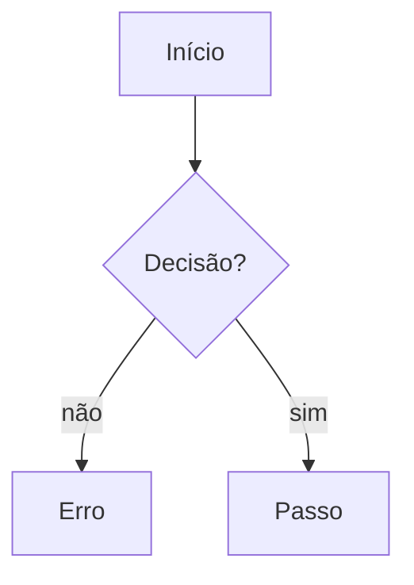
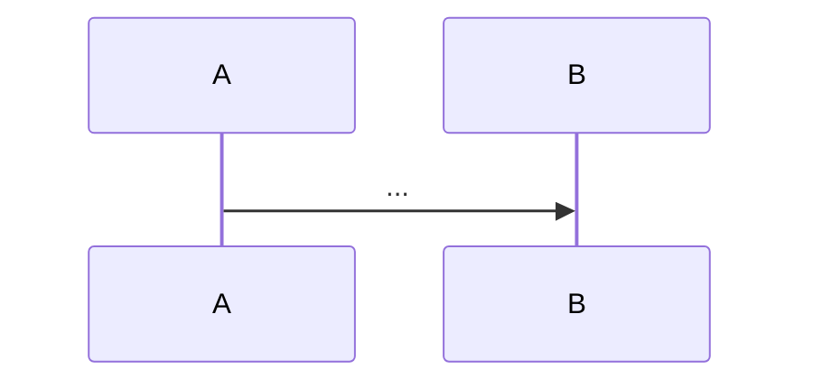

# NNNN. Nome da funcionalidade

- Status: rascunho | aprovada | implementada
- Data: AAAA-MM-DD
- Casos de uso: UC-ATOR-NN
- Requisitos não funcionais: RNF-GRUPO-NN
- Referências: [domínio](../domain.md), ADRs relacionadas

## Contexto

Que problema resolve, para qual ator, e onde se encaixa no domínio. Duas a quatro frases.

## Comportamento

Fluxo principal, passo a passo, do ponto de vista de quem usa.

1. ...
2. ...

## Fluxo

Fluxograma do que é executado, com decisões e caminhos de erro. Os caminhos de erro batem com a tabela de erros.

## Sequência

Só quando o fluxo atravessa mais de um serviço: quem fala com quem, em que ordem.

## Regras de negócio

- Regras que o comportamento deve respeitar (limites, precedências, fuso horário, arredondamento).

## Erros

| Situação | Resultado esperado |
|---|---|
| ... | erro de domínio, status HTTP, nenhum efeito colateral |

## Invariantes

Propriedades que valem sempre, inclusive sob concorrência e falha parcial.

1. ...

## Critérios de aceite

Cada critério vira ao menos um teste. Formato: dado / quando / então.

1. **Dado** ..., **quando** ..., **então** ...
2. ...

### Concorrência

1. **Dado** ..., **quando** N requisições simultâneas ..., **então** ...

## Tarefas

Ordem de implementação. Cada tarefa é verificável sozinha e vira uma issue no GitHub (skill `/cards`).

1. ... (critérios de aceite que cobre: 1, 2)
2. ...

## Fora de escopo

- O que não será feito nesta spec, e onde será tratado (fase ou spec futura).

## Questões em aberto

- Decisões pendentes que bloqueiam ou afetam a implementação.
