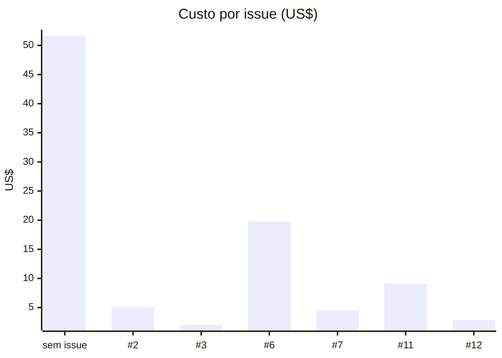

<!-- Generated by `make costs` (tokencost chart). Do not edit. -->
# Custo de IA

Custo de tokens do Claude Code por issue, a partir de [`ai-costs.csv`](ai-costs.csv). Inclui o `overhead`: chamadas que o Claude Code cobra e o transcript não registra.

Dados até 2026-10-09.

## Custo por issue



## Custo acumulado por semana

```mermaid
xychart-beta
    title "Custo acumulado por semana (US$)"
    x-axis ["2026-10-05"]
    y-axis "US$"
    line [95.0787]
```
