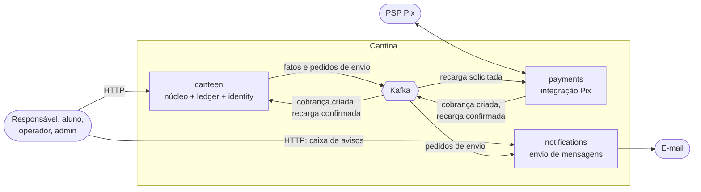
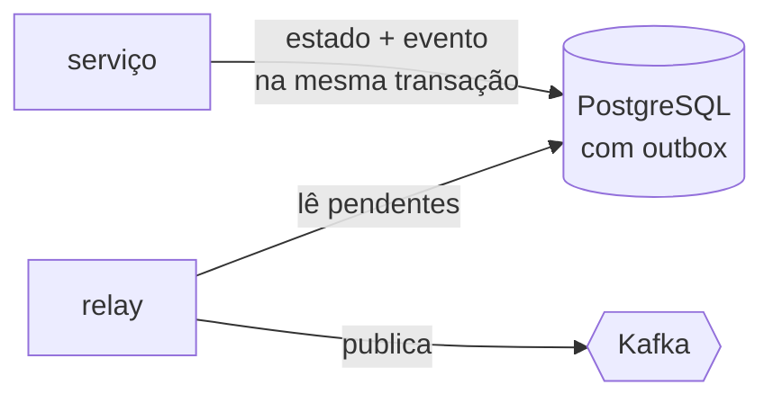
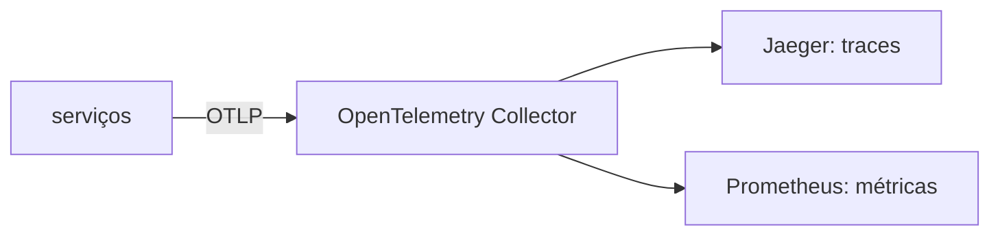

# Arquitetura

Visão geral do que roda no MVP e de como as peças se comunicam. Contextos e regras de negócio: [domain.md](domain.md). Decisões: [adr/](adr/). Quando cada peça entra: [roadmap.md](roadmap.md).

## Serviços

- Entre atores e serviços, HTTP; os atores falam com o canteen (e com o notifications só para a caixa de avisos). O payments só fala com o PSP e com o Kafka. Entre serviços, só Kafka.
- Entre contextos de domínio circulam fatos. Ao notifications vão pedidos de envio genéricos; ele não conhece o domínio.
- Cada serviço tem o próprio schema no PostgreSQL. Ledger e identity são módulos do canteen, cada um com schema próprio.

## Publicação de eventos

Vale para todo serviço que publica no Kafka.

O trabalho do serviço termina no commit. O relay publica depois; se cair no meio, publica de novo, e os consumidores são idempotentes.

## Observabilidade

A aplicação conhece só o OpenTelemetry; os backends são trocados na configuração do Collector.
