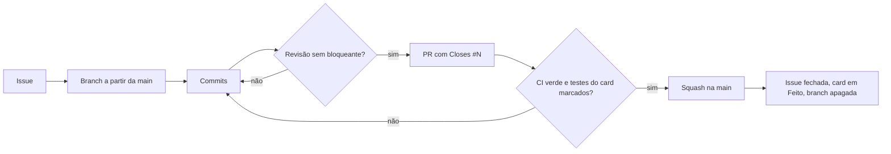

# Convenções

Regras que valem para qualquer pessoa que escreve código ou documentação no projeto.

## Idiomas

- Código, identificadores, comentários, branches, commits e PRs em inglês.
- Documentação em `docs/` em português.
- `README.md` (inglês) e `README.pt-BR.md` (português) sempre sincronizados.

## Go

- Erros: envolver com `%w`; comparar com `errors.Is`/`errors.As`; erros de domínio como valores exportados do pacote do domínio.
- Sem `panic` fora de `main`.
- `context.Context` como primeiro parâmetro em operações de I/O.

## Testes

- Unitários table-driven.
- Integração com testcontainers.

## Git

GitHub Flow: a `main` está sempre estável; cada issue tem uma branch curta que volta para a `main` por PR. Ambientes, quando existirem, são promovidos pelo pipeline com a mesma imagem, não por branch.

- Commits no formato [Conventional Commits](https://www.conventionalcommits.org): `feat(ledger): add double-entry transaction`.
- Branch por issue: `<tipo>/<issue>-<slug>`, ex.: `feat/12-register-purchase`.
- PR com título no formato do commit. Corpo com as seções `## Summary`, `## Tests` (testes do card) e `## Review` (cada achado da revisão e o que foi feito: corrigido, descartado com motivo ou sugestão pendente com motivo), e `Closes #N`.
- Merge por squash: um commit por PR na `main`.

## Dados

- Dados da aplicação (catálogo, alunos etc.) sempre persistidos.
- Dados de demonstração criados pela API de cadastro, nunca por insert direto no banco. Seed direto só como simplificação temporária registrada no roadmap.
- Mocks e dados em memória só em testes.

## Processo

- Criar arquivo, pasta, dependência ou ferramenta só quando for usado. Nada de stubs, pastas vazias ou placeholders.
